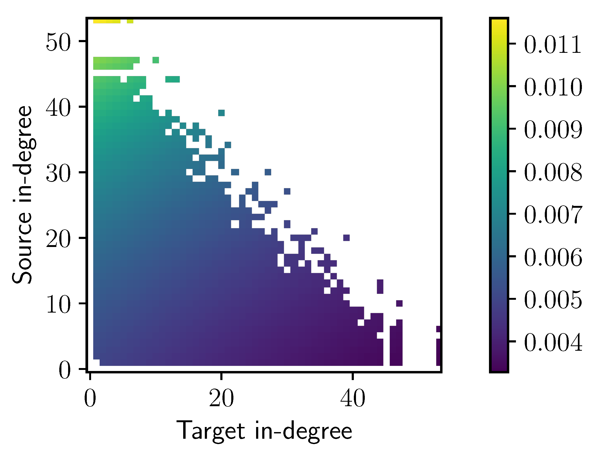
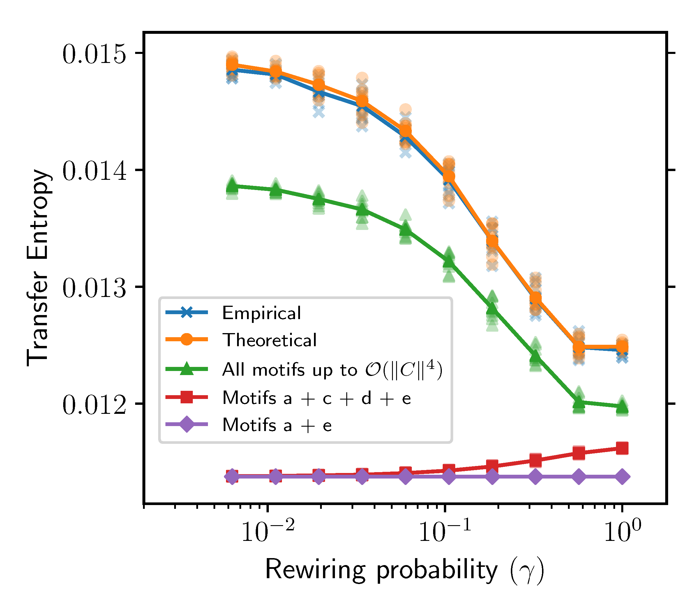
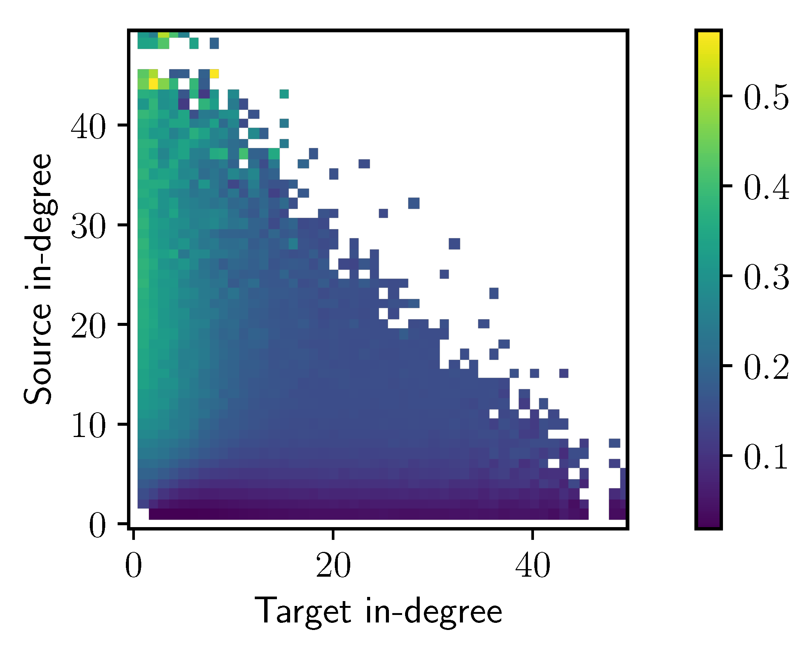
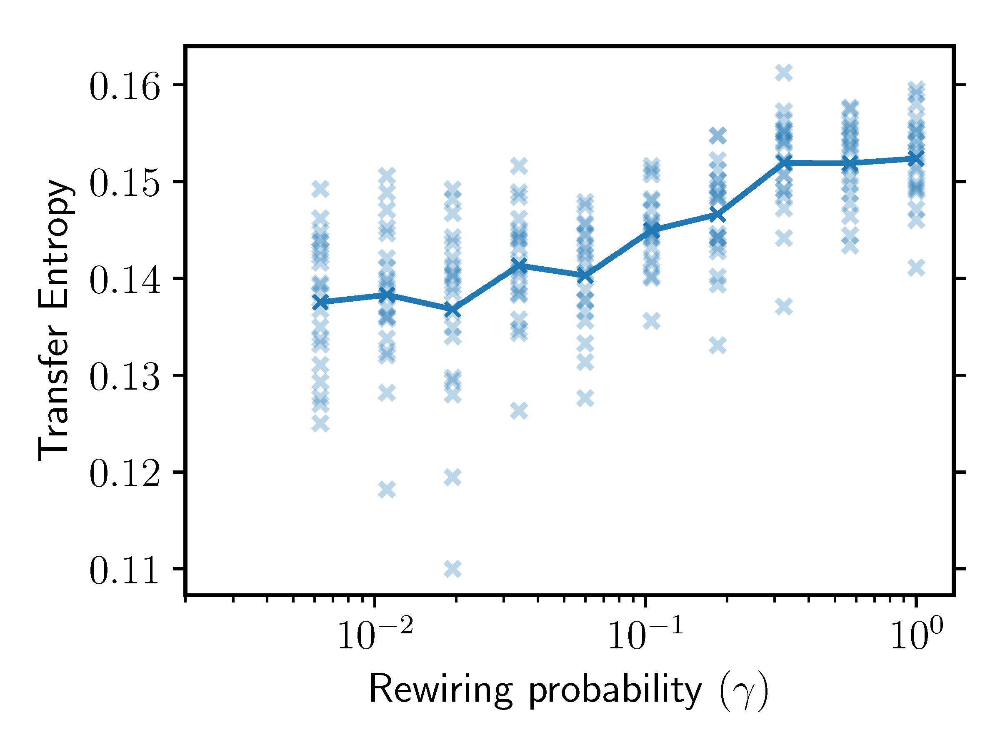

# transferEntropyMotifs

This repository contains code and data to reproduce all figures from our paper:

Leonardo Novelli, Fatihcan M. Atay, Jürgen Jost, Joseph T. Lizier (2020).
[Deriving pairwise transfer entropy from network structure and motifs](https://arxiv.org/abs/1911.02931).
arXiv:1911.02931.

## Figures

Figure 1: generated manually to illustrate the motifs.

### Figure 2: Pairwise transfer entropy as a function of source and target in-degree.

### Figure 3: Average transfer entropy as a function of the rewiring probability in Watts-Strogatz ring networks.

### Figure 4: Pairwise transfer entropy as a function of source and target in-degree in random Boolean networks.

### Figure 5: Average transfer entropy as a function of the rewiring probability in Watts-Strogatz ring networks with a random Boolean dynamics.
